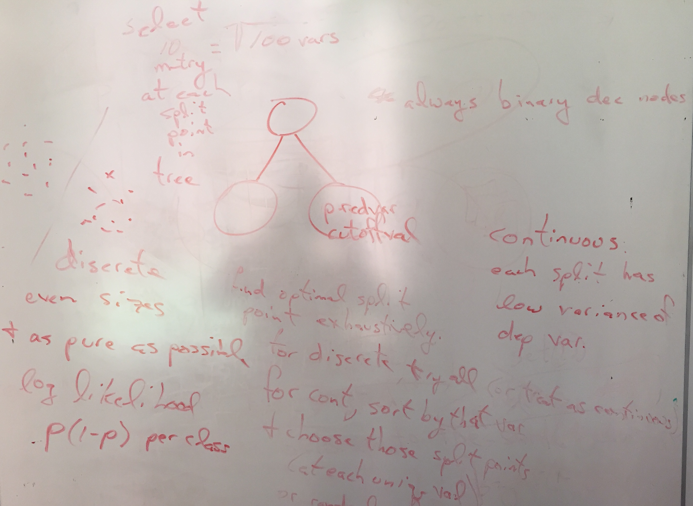

# Simple Random Forest(tm) in Java

[codebuff](https://github.com/antlr/codebuff) could really use a random forest so I'm playing with an implementation here.

**Limitations**

All `int` values but supports categorical and numerical values.

**Notes from conversation with** [Jeremy Howard](https://www.usfca.edu/data-institute/about-us/researchers)

select m = sqrt(M) vars at each node

for discrete/categorical vars, split in even sizes, as pure as possible.
 
log likelihood or p(1-p) per category

each node as predicted var, cutoff val

nodes are binary decisions

find optimal split point exhaustively.

for discrete, try all (or treat as continuous)

for continuous variables, sort by that variable and choose those split points at each unique value. each split has low variance of dependent variable

**References**

[ironmanMA](https://github.com/ironmanMA/Random-Forest) has some nice notes.

[Breiman's RF site](https://www.stat.berkeley.edu/~breiman/RandomForests/cc_home.htm)

[patricklamle's python impl](http://www.patricklamle.com/Tutorials/Decision%20tree%20python/tuto_decision%20tree.html)